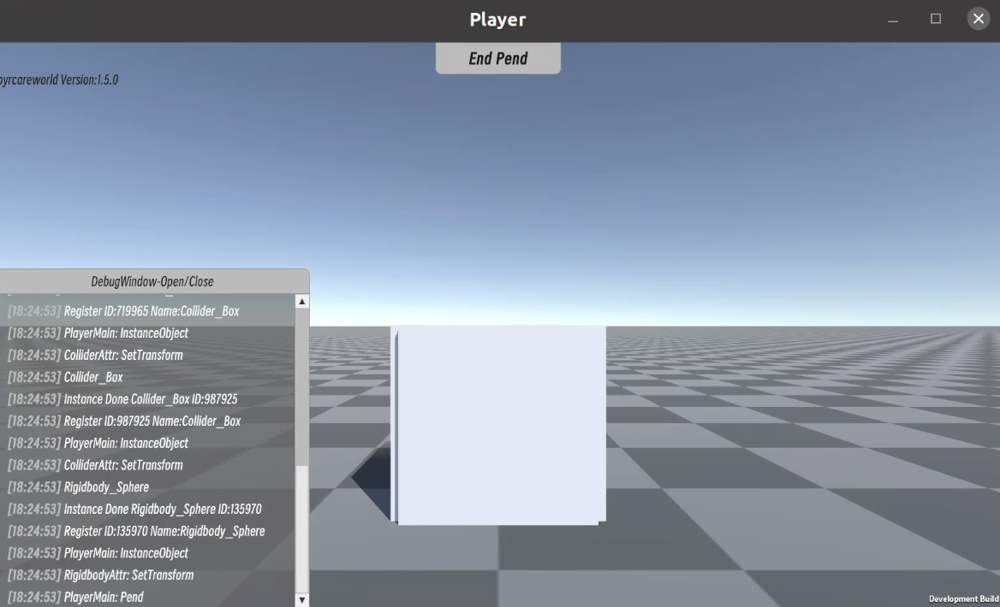

# Here is the code for RCareWorld PhyRC Challenge 🦾
This codebase requires a minimal installation of RCareWorld. You will have access to executables for the competition. We will release the simulation environments for the robot-assisted dressing and bed bathing before Aug 8th AOE.

This repo is currently in the testing stage.

- Check the website https://emprise.cs.cornell.edu/rcareworld/
- APIs: Please only refer to this document if you are participating in the PhyRC challenge. Please don't use the links in the main branch. https://rcareworld.readthedocs.io/en/phy-robo-care/
- Discuss in the forum https://github.com/empriselab/RCareWorld/discussions


# Hardware requirements
While RCareWorld supports Linux, Windows, and Mac (experimental), our evaluation platform is based on Ubuntu 20.04. We do not guarantee the simulation environments for the competition work on MacOS, Windows, or other Linux versions as intended. The executable files are only for Linux systems. If you want to use Windows, you might consider using [WSL](https://learn.microsoft.com/en-us/windows/wsl/install) which ideally has the same functionality as Ubuntu.

We highly recommend using an Ubuntu 20.04 system which will be used for evaluation. For this competition, all tutorials are based on the Ubuntu system.

Please ensure your computer has at least 10GB of free space before starting. One or multiple discrete graphics cards with proper drivers are highly recommended. 

# Download Guide
<!-- - Clone the repo: `git clone https://github.com/empriselab/RCareWorld.git`
- Switch to the `phy-robo-care` branch: `cd RCareWorld` and then `git checkout phy-robo-care ` -->
Clone the `phy-robo-care` branch of the repo: 

`git clone -b phy-robo-care https://github.com/empriselab/RCareWorld.git`

# Install Guide
## Pre-install Guide
Before starting, make sure Conda is installed on your computer.
For details, refer to the Conda installation guide: [Conda Installation Guide](https://docs.conda.io/projects/conda/en/latest/user-guide/install/index.html).

If you have a Nvidia GPU, install Nvidia Driver from the official [NVIDIA Driver Downloads](https://www.nvidia.com/Download/index.aspx).

Install the necessary libraries:
```
    sudo apt-get update
    sudo apt-get install libassimp-dev libopenblas-dev liblapack-dev
```

## Install RCareWorld
Then you can install the RCareWorld!

<!-- - Create a conda environment with Python 3.10: `conda create -n rcareworld python=3.10`
- Activate the conda environment: `conda activate rcareworld`
- Install the requirements: `cd pyrcareworld` and then `pip install -r requirements.txt`
- Install pyrcareworld: `pip install -e .`
- Verify the installation works: `cd pyrcareworld/demo/examples` and run `python test_scene.py`. You should expect to see the RCareWorld Unity executable window pop up with a white cube. -->

```
# Create a conda environment with Python 3.10
conda create -n rcareworld python=3.10

# Activate the conda environment 
conda activate rcareworld

# Install the requirements
cd pyrcareworld
pip install -r requirements.txt
pip install -e .
pip install upgrade open3d

# Verify the installation works
cd pyrcareworld/demo/examples
python test_scene.py

```
A window with white cubes will pop up as the screenshot shows. This indicates the installation is successful.



 
# Get Started with the Examples
Check the examples in `pyrcareworld/pyrcareworld/demo/examples` folder. 

Go through the examples, run the examples, and read the comments in the code to understand the corresponding output and related APIs. 

# Starter Scripts for Bathing and Dressing Tasks
Check the `test_bathing.py` and `test_dressing.py` to get an overall idea about how to use the simulation environments for the dressing and bathing task. 

**`test_bathing.py` and `test_dressing.py` are in `RCareWorld/template`**

Your score will be stored in a JSON file called `spongeScore.json` for bathing and `dressingScore.json` for dressing under `~/.config/unity3d/RCareWorld/BathingPlayer/` for bathing and `~/.config/unity3d/RCareWorld/DressingPlayer/` for dressing.

# Submit to EvalAI
Once you are done with your solutions, submit your code to EvalAI following [this](https://rcareworld.readthedocs.io/en/phy-robo-care/submission.html) tutorial. Remember, you need to sign up as a team on EvalAI before Sep 8 (11:59pm AOE) to participate.
